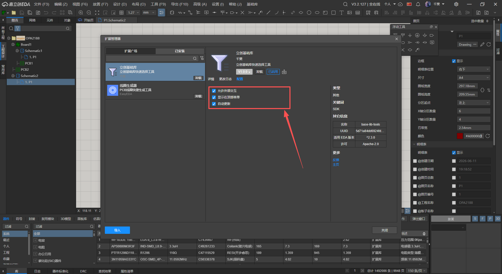
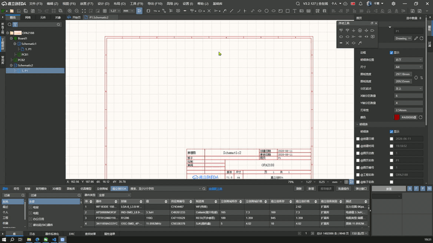
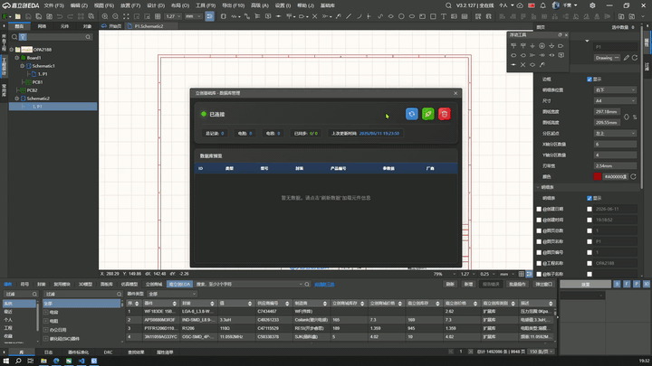
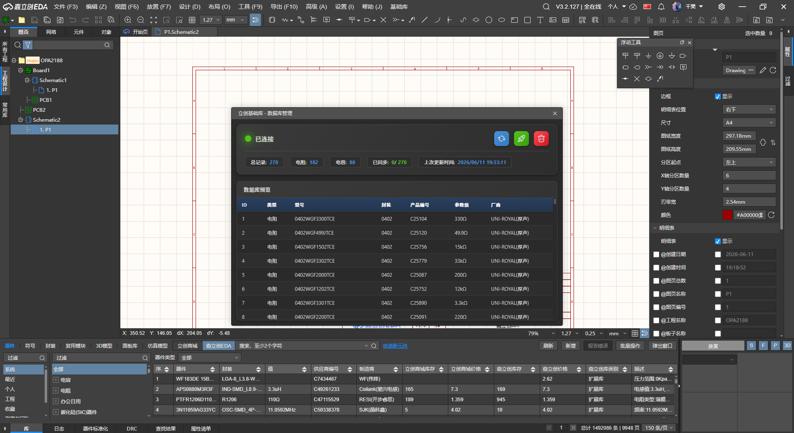
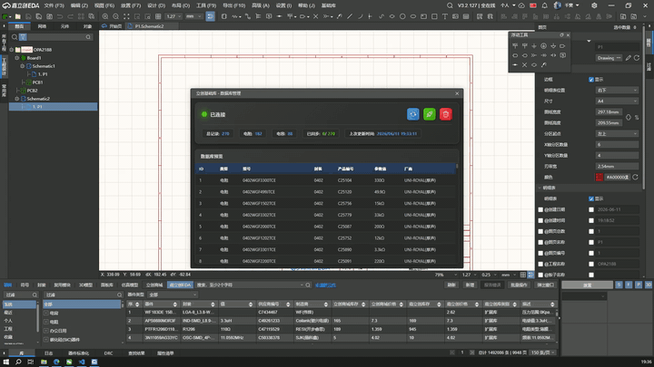
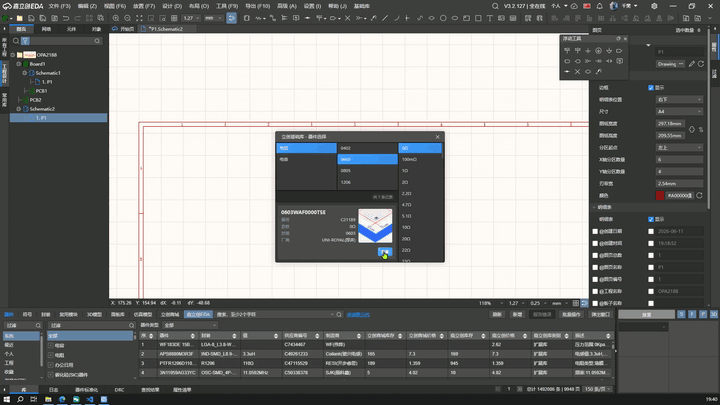

# 立创基础库

## 简介

立创基础库是一款面向嘉立创 EDA (LCEDA) 专业版的扩展插件，专注于解决基础元器件（电阻、电容）的快速选型和原理图放置问题。

通过从立创商城 SMT 基础库同步数据到本地 IndexedDB，插件提供了按**器件类型 → 封装 → 参数值**三级联动的筛选体验，并支持将选中的器件一键放置到原理图画布中，大幅提升电路设计效率。

## 功能特性

-   **快速筛选**：支持按器件类型（电阻/电容）、封装（0402/0603/0805/1206）、参数值（阻值/容值）三级联动筛选，快速定位目标器件
-   **一键放置**：选中器件后调用 EDA 原生 API，将器件绑定到鼠标光标，点击画布即可完成放置
-   **本地数据库**：基于 IndexedDB 构建本地元器件数据库，离线可用，数据安全可靠
-   **数据同步**：从立创商城自动拉取 SMT 基础库数据，支持断点续传，进度持久化到 localStorage
-   **UUID 自动补全**：通过网络 API 批量查询并补全器件的 `componentUuid` 与 `libraryUuid`，确保放置功能正常
-   **卡片式展示**：结果以卡片形式呈现，包含型号、封装、参数值、厂商及产品图片
-   **参数值智能排序**：阻值按 mΩ → Ω → kΩ → MΩ，容值按 pF → nF → μF → mF → F 物理大小排序

## 安装

1. 下载 `.eext` 扩展包
2. 打开立创 EDA 专业版，进入 **扩展 → 扩展管理**
3. 点击 **导入扩展**，选择下载的 `.eext` 文件
4. 点击配置选项，勾选三个复选框
   
5. 安装完成后，顶部原理图菜单栏会出现 **基础库** 菜单

## 使用指南

### 第一步：同步数据库

1. 点击菜单 **基础库 → 数据库更新**
   
2. 在弹出的管理窗口中，点击 **刷新数据** 按钮
   
3. 插件将自动从立创商城拉取 0402/0603/0805/1206 封装的电阻（439 类目）和电容（313 类目）数据，下面是加载的立创基础库数据
   
4. 刷新完成后，点击 **同步 UUID** 按钮，为每条记录补全 EDA 的信息，后续放置器件会更快速，否则每次放置器件都要从服务器获取数据，这个同步可以断点同步，不用电脑的时候体同步一下就行。当然不同步也是可以使用的，只是放置器件的时候会稍微慢一点。
   

### 第二步：选择器件

1. 点击菜单 **基础库 → 立创基础库选择**
2. 在左侧依次选择 **器件类型**（电阻/电容）→ **封装** → **参数值**（右侧栏）
   
3. 系统将自动筛选匹配的器件并以卡片形式展示

### 第三步：放置器件

1. 在结果列表中找到目标器件，点击卡片上的 **放置** 按钮
2. 鼠标光标将绑定该器件，移动鼠标到原理图目标位置
   

## 开发

### 环境要求

-   Node.js >= 20.5.0
-   立创 EDA 专业版 >= 2.3.0